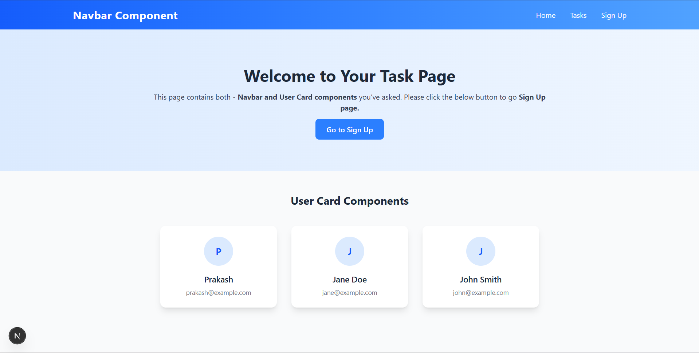
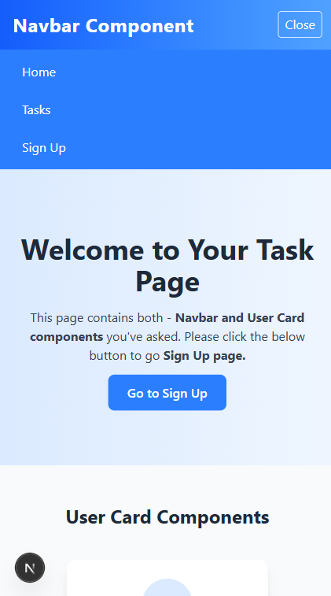
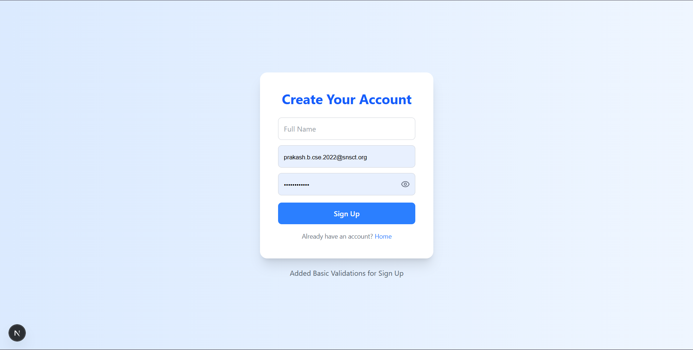
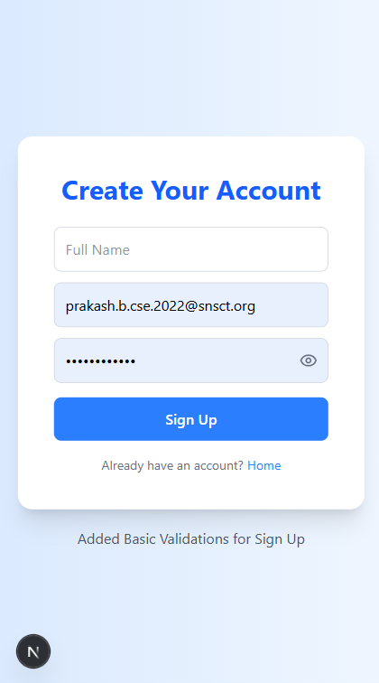
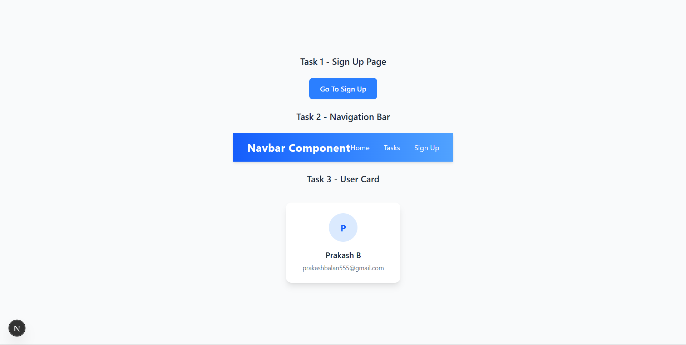
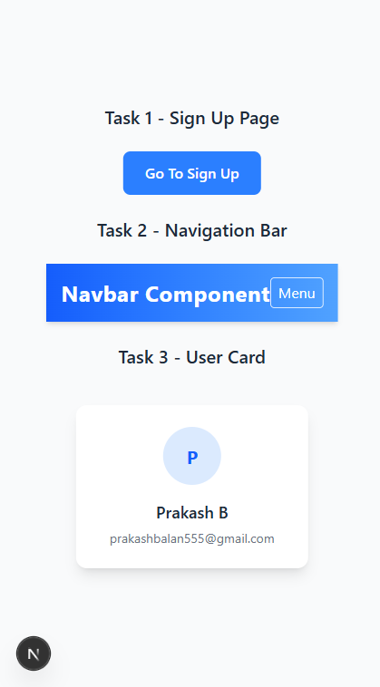

# Simpler Technologies Internship Tasks

This project contains solutions for internship tasks built using **Next.js (App Router)**, **Tailwind CSS**, and **React**.
All tasks are implemented in a **single Next.js project** for simplicity and easier demonstration.

---

## Tech Stack

* **Framework:** [Next.js 14+ (App Router)](https://nextjs.org/docs/app)
* **Language:** JavaScript (ESLint enabled)
* **Styling:** [Tailwind CSS](https://tailwindcss.com/)
* **Package Manager:** npm
* **Components:** React functional components

---

## Project Structure

```bash
simpler-technologies-internship-tasks/
│
├── src/app/
│   ├── page.jsx            # Home Page (Task 1 - Navbar + Welcome section)
│   └── layout.jsx
│   └── globals.css         # global styles
│   └── signup/
│       └── page.jsx        # Task 2 - Sign-Up Page
│
├── src/components/
│   ├── Navbar.jsx          # Task 2 - Responsive Navbar
│   └── UserCard.jsx        # Task 3 - User Card Component
│
├── public/                 # Public assets (images, icons if added)
│   └── screenshots         # Screenshots of pages for README.md file
│
├── package.json
├── tailwind.config.js
├── postcss.config.js
└── README.md
```

---

## Tasks Implemented

### **Task 1: Home Page**

* Built a landing page (`/app/page.jsx`).
* Displays the `Navbar` component at the top.
* Contains a simple **Welcome section** with project introduction.

### **Task 2: Responsive Navbar**

* Created a reusable `Navbar` component (`/components/Navbar.jsx`).
* Features:

  * Responsive design (works on desktop and mobile).
  * Includes navigation links to **Home** and **Sign-Up Page**.
  * Mobile hamburger menu with dropdown.

### **Task 3: Sign-Up Page**

* Implemented `/signup/page.jsx`.
* Features:

  * Input fields: **Full Name, Email, Password**.
  * Basic form validations:

    * Name required.
    * Valid email required.
    * Password must be at least 6 characters.
  * Added **show/hide password toggle** using an eye icon.
  * On successful submission:

    * Shows a success alert.
    * Clears form.
    * Redirects user to **Home Page (`/`)**.

### **Task 4: User Card Component**

* Created a reusable `UserCard` component (`/components/UserCard.jsx`).
* Displays:

  * User avatar (image placeholder).
  * Name & Email.
  * Basic styling with Tailwind CSS.
* Can be integrated in future pages for displaying user details.

---

## Setup & Installation

1. Clone the repository:

   ```bash
   git clone https://github.com/praghu-b/simpler-technologies-internship-tasks.git
   cd simpler-technologies-internship-tasks
   ```

2. Install dependencies:

   ```bash
   npm install
   ```

3. Run the development server:

   ```bash
   npm run dev
   ```

4. Open in browser:

   ```
   http://localhost:3000
   ```

---

## Screenshots

### Home Page



### Sign-Up Page



### Tasks Page



---

## Notes

* Unnecessary default Next.js boilerplate files (logos, example APIs, etc.) were removed.
* All three tasks are implemented inside a **single Next.js project** as per internship instructions.
* Code is structured to be modular and reusable.

---

## Author

**Prakash B** – Final Year B.E. CSE Student

* Full-Stack Developer (Next.js, Express.js, Django, FastAPI, MongoDB)
* Interested in **AI, Agentic AI, and Web Development**